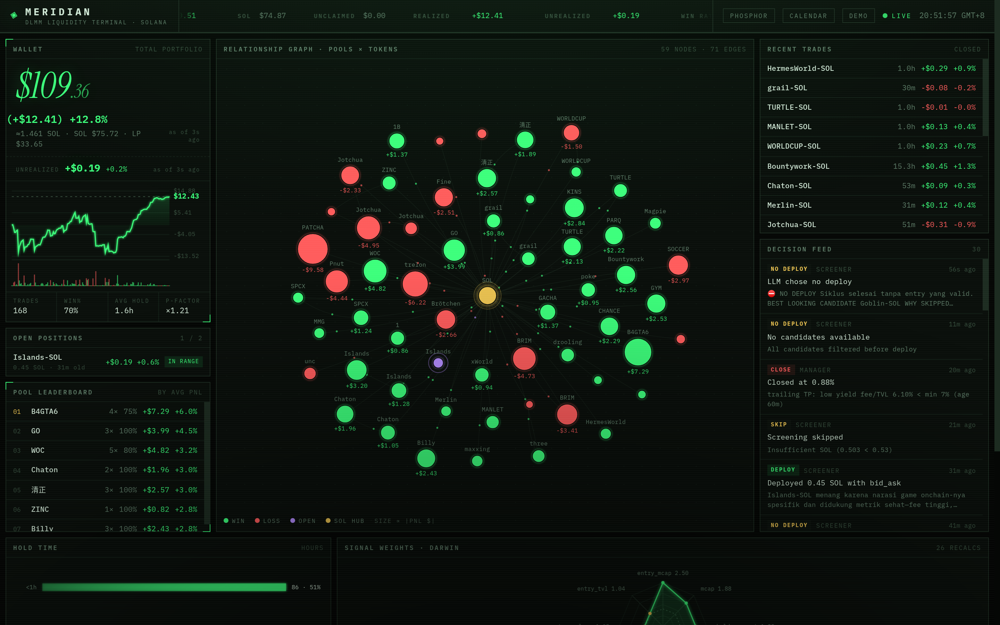
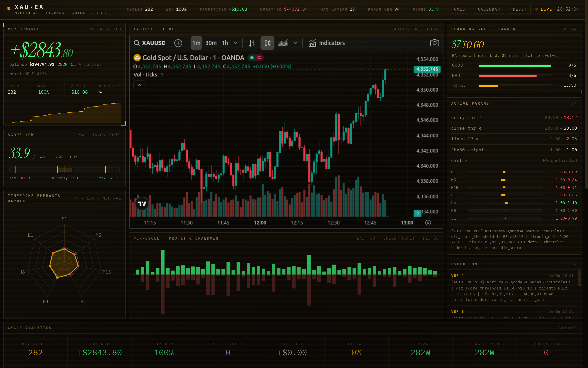
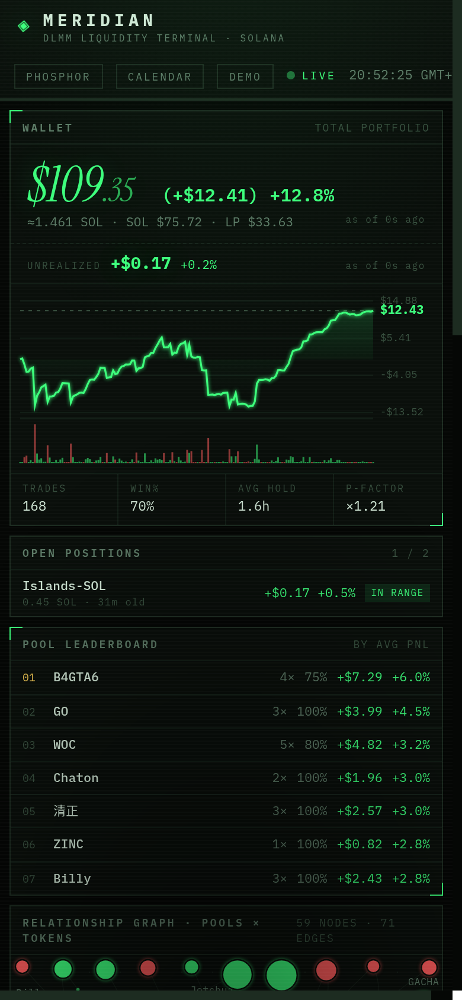
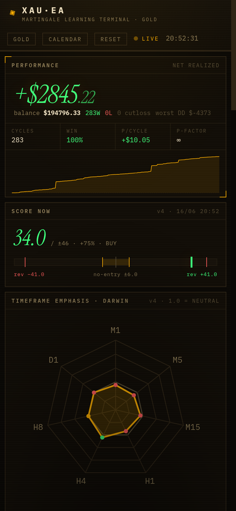

# Phosphor Terminal — Design Language

The shared design system behind two live trading dashboards: **MERIDIAN** (DLMM liquidity terminal · Solana) and **XAU·EA** (martingale learning terminal · gold). One visual language, two skins.

A dark, monospace, hairline-bordered **instrument panel** with phosphor-CRT atmosphere — scanlines, vignette, accent glow, a single italic-serif hero numeral per screen.

👉 **Full spec + copy-paste CSS/HTML for AI agents: [DESIGN.md](DESIGN.md)**

## MERIDIAN — phosphor green (default skin)

## XAU·EA — amber / gold skin

## Responsive (390px phone width)

| MERIDIAN | XAU·EA |
|---|---|
|  |  |
